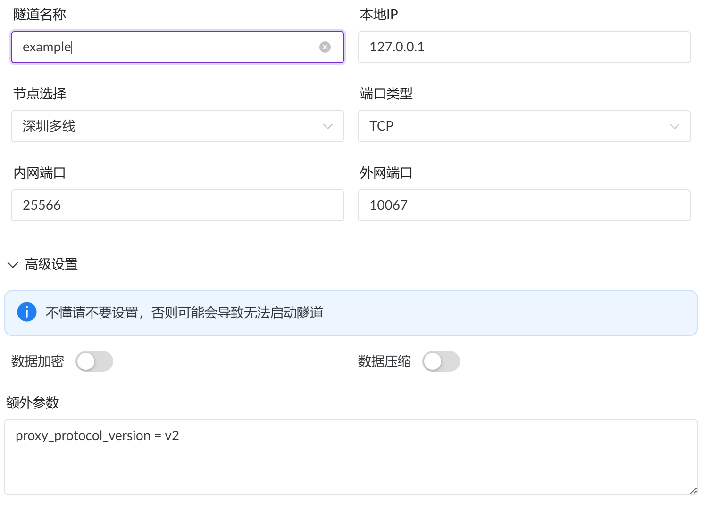
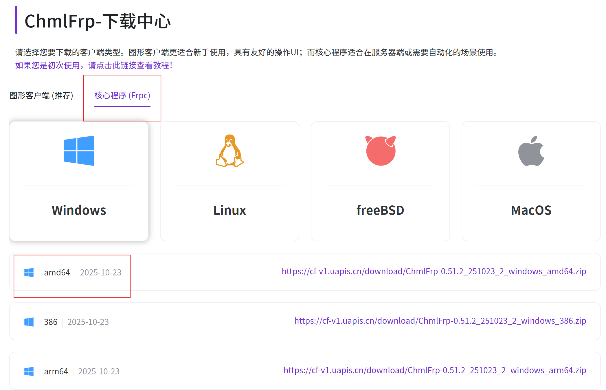

# How to Force Players to Switch to a Public IP to Join a Minecraft Server Under a RadminVPN Virtual LAN
v1.0 | by AXFJ | This document is licensed under CC BY 4.0.

**English** | [中文](README_zh.md)

## 1. Preface

> When hosting a server under a virtual LAN such as RadminVPN, you often encounter malicious griefers. Because of the special nature of virtual networks, users can switch IP addresses using special methods, so ban-ip cannot effectively block griefers.

- This tutorial explains how to force all players to automatically switch to a public IP when joining the server.
- After following this tutorial, you can achieve the following:
  1. Players enter your server through the virtual IP.
  2. Players are seamlessly redirected to a public IP server (which can be FRP), and therefore they themselves will also use the public IP to enter the server.
  3. As a result, players expose both their virtual IP and public IP. If they are banned by IP, even if they change their virtual IP, they will still join the server using the same public IP, greatly improving server security.

## 2. How It Works

(This involves game communication protocol technology. If you don't want to read it, skip to the next section.)

The vanilla game has a `/transfer` command that can transfer a specified player to another server. Therefore, by using a special server that immediately sends `ServerTransferS2CPacket` to our other server located on a public IP as soon as a player joins, the player enters the server via the public IP.

It should be noted that this process is **not transparent** to the client. Therefore, players with malicious intent can modify the client so that after receiving the transfer packet, it immediately disconnects when it discovers the target server is a public IP. However, this does not cause much trouble, since they cannot enter the actual server. Such clients that refuse further connection are themselves suspicious IPs.

## 3. Preparation

Prepare the following:
1. [Transfer Server Router](github.com/AXFJ/Transfer-Server-Router/releases): the transfer server core, or download it from [Lanzou Cloud](https://wwati.lanzouu.com/i6jPf44cj7zc).
2. Minecraft server core: Paper or Purpur is recommended. This document uses version 1.21.11. Configuration for cores other than Paper and its derivatives is slightly more complicated, as mentioned later.
3. FRP (intranet penetration) or a public IP server: it is recommended to use [ChmlFrp](https://chmlfrp.net), which is stable and free.
4. LAN broadcaster (optional): used to broadcast your server to the LAN world list. You can use [Sculk Toolkit](https://github.com/AXFJ/Sculk-Toolkit) or download it from [Lanzou Cloud](https://wwati.lanzouu.com/i6Ofv44cjsib).

Then you can begin configuration.

---

## 4. Configuration

### 1. Start the Transfer Service

1. Open Transfer Server Router.
   It should display a log similar to the following:
   ```text
   Transfer Server Router v1.0 by AXFJ
   See https://github.com/AXFJ/Transfer-Server-Router.
   [2026-08-24 18:12:50] [INFO] [-] Configuration file tsr_server.properties does not exist, using default configuration and creating default file.
   [2026-08-24 18:12:50] [INFO] [-] Listen on：0.0.0.0:25565 -> example.com:25565
   [2026-08-24 18:12:50] [INFO] [-] Protocol Version：774
   [2026-08-24 18:12:50] [INFO] [-] Limitations：Total Concurrent=5, Per-IP Concurrent=2, Rate=1.0 req/s, Timeout=15s
   ```
   You can close the program at this point.

   At this point, a `tsr_server.properties` file will appear in the program folder. This is the transfer server's configuration file. Open it and find the following settings:
   ```properties
   ip=0.0.0.0
   port=25565
   ```
   This is where the transfer server will run. It is recommended to use the default port 25565; modify other settings as needed. Usually there is no need to change `ip`.
   ```properties
   target-ip=example.com
   target-port=25565
   ```
   This is the location to which the transfer server will redirect players after they connect. We will modify it later. Other options generally do not need to be changed.
2. Start the transfer server.

### 2. Preparing Intranet Tunneling

If you have a public IP address, skip this section.

This section will use [ChmlFrp](https://chmlfrp.net) as a demonstration. You can use other services as well; the steps are basically the same.

1. Open [ChmlFrp](https://chmlfrp.net) and register an account.
2. Open the dashboard and find "Tunnel Management".
3. Choose a node you like and create a tunnel.

   

   The internal port is the port your server runs on, and the external port can be any port you choose.
   The "Extra Parameters" must be filled in as follows:
   ```ini
   proxy_protocol_version = v2
   ```
4. Now you can change `target-ip` and `target-port` in `tsr_server.properties` to your tunnel information. Port 25566 is recommended.

### 3. Running the Intranet Tunnel

1. Download the **core command-line client** from your tunneling provider's official website. This is very important.
 
   

2. Find the "Configuration File" section on the dashboard, go in, select your node and tunnel, and click Generate. You will then see a bash script in the "Startup Command" section, similar to this:
   ```bash
   frpc.exe -u uwDm8l...XgpzX -p 319120
   ```
3. Copy it and run it in the directory containing the core file `frpc.exe`.
4. If everything is fine, frp has started successfully.

This completes the intranet tunneling configuration.

### 4. Start the Minecraft Server

1. Download the 1.21.11 server core from the [Paper](https://fill-ui.papermc.io/projects/paper/version/1.21.11) official website. Higher or lower versions may be compatible, but it is recommended to start with 1.21.11.
2. Save it to any folder, open a terminal, and run:
   ```bash
   java -jar paper-1.21.11-132.jar
   ```
3. When "Done" appears, stop the server and proceed with further configuration.
4. Open `server.properties` and modify the following settings:
   ```properties
   accept-transfers=true
   ...
   ip=127.0.0.1
   port=<the local port you set for the tunnel in your FRP configuration>
   ...
   ```
   Here, `ip` must be set to `127.0.0.1`.
5. For Paper-based servers:

   1. Open `config\paper-global.yml`.
   2. Find this section:
      ```yml
      proxies:
        ...
        proxy-protocol: false
        ...
      ```
      Change `proxy-protocol` to `true`.

   For non-Paper servers (including upstream Spigot), you need to install a plugin; I will not go into detail here. The following are references:

   - Spigot / Bukkit: HAProxy Detector
   - Fabric / Quilt: Proxy Protocol Support
   - Forge / NeoForge: same as above
   - Vanilla: cannot be configured

6. Start the server.

## 4. Done

At this point, all programs have been configured. Now open the game client, enter your virtual IP (the transfer server's port), and check whether you are connected to the public server and whether the server console shows your public IP.

## 5. FAQ

If you run into any problems, go through the tutorial from beginning to end again. If you still have issues, you can contact me.

QQ: 3647980885

Email: its-axfj@outlook.com

Oh, by the way, if you want to use the broadcaster, please use LAN-only mode.
